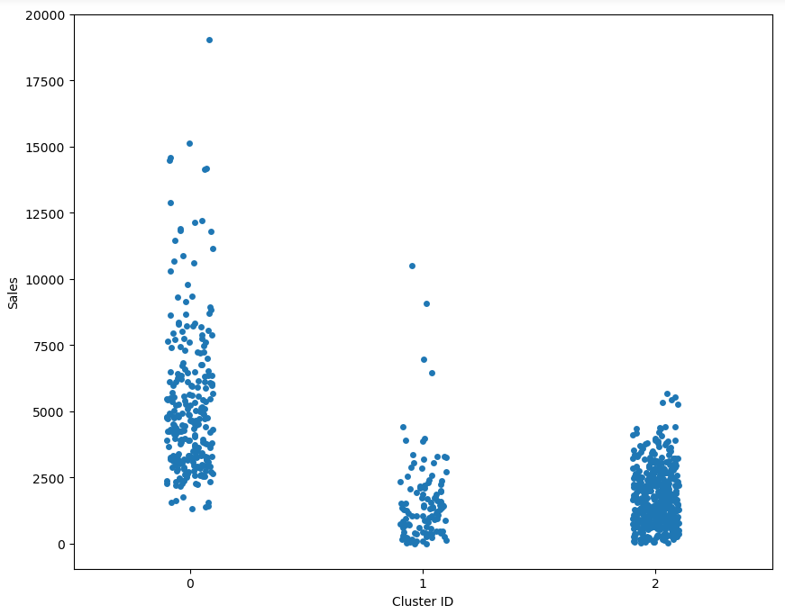
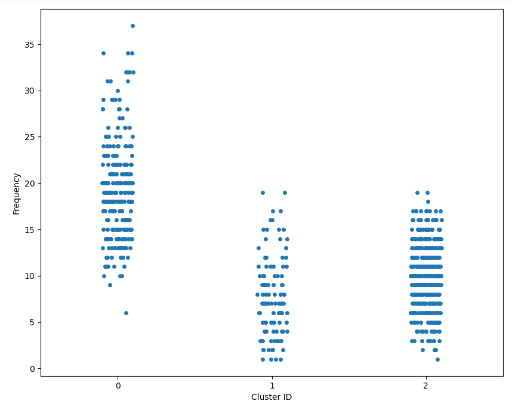
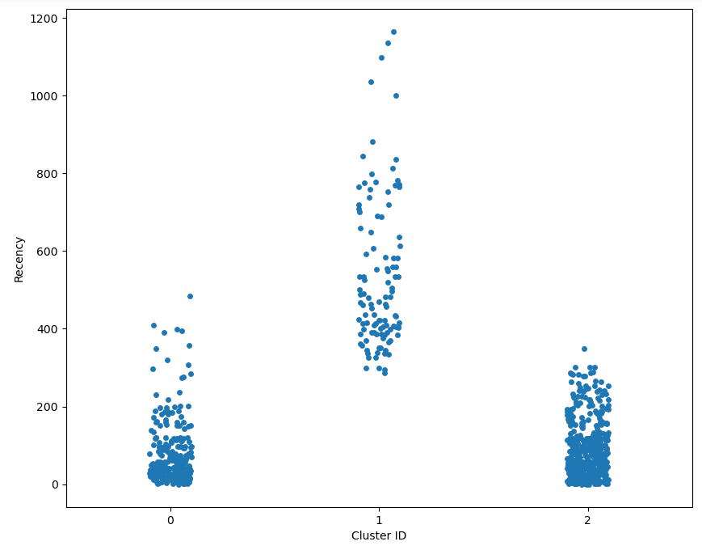

# Customer Behavior Analysis for Sales Growth

### Problem Statement:
Increase sales by identifying the factors that influence customer behavior.

### Objectives:
1. Identify the top three factors that influence customer behavior.  
2. Develop a plan to address the identified factors.

### Scope:
- Use **sales data**, **customer data**, and **marketing data** from the past year.  
- Focus on a specific product line.

### Data:
- **Sales data**  
- **Customer data**  
- **Marketing data**  

---

## Methods and Tools

- **Regression analysis**  
- **Decision tree analysis**  
- **Customer segmentation**

### Success Metrics:
- Increase in revenue after implementing the plan.

---

## Data Preprocessing & Cleaning

### Loading Data:
- Data is loaded from a CSV file containing sales, customer, and marketing data.  
- **Data Overview:**  
   - Total entries: **9994**  
   - Total columns: **21**  
   - Includes features such as `Order ID`, `Customer ID`, `Segment`, `Sales`, `Profit`, etc.

### Data Inspection:
- **Null Values:** No null values across the columns.  
- **Type Conversion:** `Customer ID` is converted to string type to ensure proper processing.

### Feature Engineering:
1. Created the **Difference_Date** column to calculate **recency**:  
   - Captures the number of days between the latest order date and each order date.  
2. Calculated **RFM values**:  
   - **Recency**: Number of days since the last purchase.  
   - **Frequency**: Number of orders placed.  
   - **Monetary**: Total sales per customer.

### Outlier Removal:
- **IQR-based filtering** was applied to remove extreme outliers in Sales, Frequency, and Recency attributes.

---

## Data Analysis

### RFM Model:
The **RFM (Recency, Frequency, Monetary)** model is applied to evaluate customer behavior:
- **Recency**: Number of days since the customer last made a purchase.  
- **Frequency**: Total number of orders placed by each customer.  
- **Sales**: Total sales value per customer.

### Customer Segmentation (Clustering):
1. **Scaling Data**: RFM values are normalized using `StandardScaler`.  
2. **KMeans Clustering**:  
   - KMeans clustering is applied to segment customers into **four clusters** based on RFM values.

### Data Visualization:
- **Boxplots** are used to visualize the distribution of **Sales**, **Frequency**, and **Recency**.  
- **Scatter Plots**: Show clustering results based on the scaled RFM data.

---

## Results

### Customer Segmentation:
Customers are divided into **four clusters** representing different buying behaviors. These clusters can guide targeted marketing strategies.

### Top Influential Factors:
The top three factors influencing customer behavior are:  
1. **Recency**: How recently a customer has made a purchase.  
2. **Frequency**: The number of purchases made by a customer.  
3. **Sales**: The total monetary value spent by the customer.

---

## Plan to Address Identified Factors

### 1. Recency:
- **Plan**: Implement strategies to engage customers who have not made a recent purchase:  
   - Personalized email campaigns.  
   - Special discounts for dormant customers.

### 2. Frequency:
- **Plan**: Encourage repeat purchases through:  
   - Loyalty programs.  
   - Bundling deals for frequently bought products.

### 3. Sales:
- **Plan**: Focus on high-value customers to maximize lifetime value:  
   - Premium services or product offerings.  
   - Exclusive deals or memberships.

---

## Tools & Techniques

### Python Libraries:
- **Pandas**: For data manipulation.  
- **Seaborn, Matplotlib**: For data visualization.  
- **Scikit-learn**: For data scaling and clustering using KMeans.  

### Clustering:
- **KMeans Clustering**: Used to segment customers into distinct groups based on their RFM values.

---

## Conclusion & Next Steps

### Key Insights:
- Customer segmentation provided valuable insights into buying behavior.  
- Customers with **high recency** and **frequency** can be targeted for promotional campaigns.  
- High-value customers (high **sales**) can be nurtured with tailored offerings.

### Next Steps:
1. Refine customer segmentation with more granular data (e.g., region, product segments).  
2. Implement marketing strategies tailored to each customer group based on their cluster.  
3. Monitor the increase in revenue after implementing these strategies.  

---

## Project Summary:
This project analyzes customer behavior using the **RFM model** and **KMeans clustering** to identify key factors influencing sales and develop actionable plans to increase revenue.
